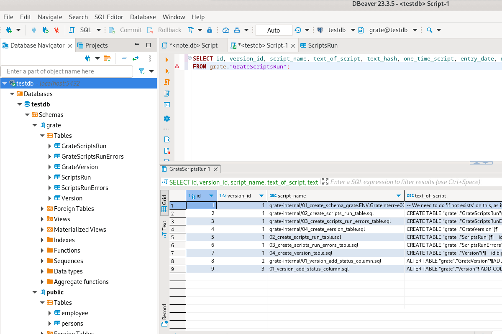
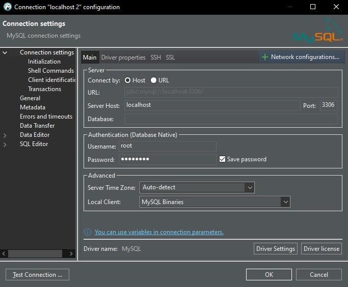
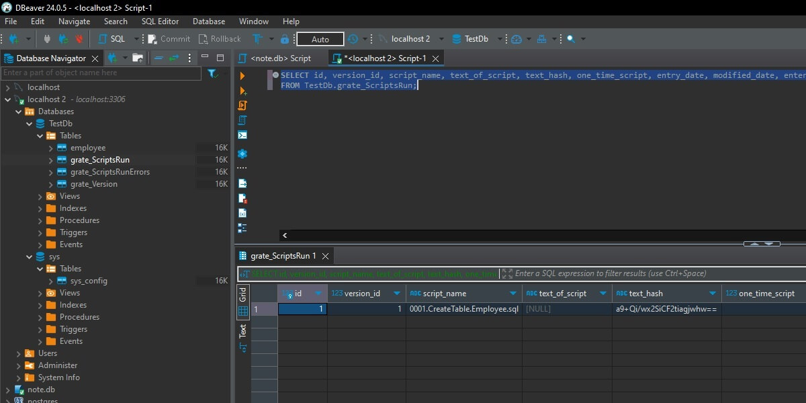

# PT_Demo_GrateDatabaseMigration

PT_Demo_GrateDatabaseMigration is a simple demo to explain [Grate](https://github.com/erikbra/grate/tree/main).


## Contents
- [Demo using Docker - Grate Docs Example](#demo-using-docker---grate-docs-example)
- [Demo using Docker - DK Example](#demo-using-docker---dk-example)
- [Links](#links)

## Demo using Docker - Grate Docs Example

1. Create the following folder structure:

- /src
    - /docker
        - /db
            - /dropDatabase // -1. Anytime
            - /createDatabase // 0. Anytime
            - /beforeMigration // 1. Everytime
            - /alterDatabase // 2. Anytime
            - /runAfterCreateDatabase // 3. Anytime
            - /runBeforeUp // 4. Anytime
            - /up // 5. One-Time
            - /runFirstAfterUp // 6. One-Time
            - /functions // 7. Anytime
            - /views // 8. Anytime
            - /sprocs // 9. Anytime
            - /triggers // 10. Anytime
            - /indexes // 11. Anytime
            - /runAfterOtherAnyTimeScripts // 12. Anytime
            - /permissions // 13. Everytime
            - /afterMigration // 14.  Everytime
        - /output

2. In `/up` folder, create SQL script `0001.CreateTable.Employee.sql`:

- /src
    - /docker
        - /db
            - /up
                - 0001.CreateTable.Employee.sql

```
CREATE TABLE employee (
  id int PRIMARY KEY, 
  name text,
  age int
);
```

3. In `/docker` folder, create file `docker-compose.yml`:

- /src
    - /docker
        - docker-compose.yml

```
version: "3.7"
services:
  db-migration:
    #build: .
    image: erikbra/grate:latest
    environment:
      # don't configure passwords here for real.  This is just a sample!
      APP_CONNSTRING: "Server=your-remote-public-ip-address:your-remote-port;Database=your-db;User Id=your-user-id;Password=your-user-pass;TrustServerCertificate=True"
      VERSION: "1.0.0.0"
      DATABASE_TYPE: "postgresql" # sqlite, oracle, postgresql, sqlserver, mariadb
    volumes:
      - ./db:/db
      - ./output:/output
```

4. Run Docker containers using the `docker-compose.yml` and remove them once you finish with the demo:

```
docker-compose up -d
docker-compose down -v
```

5. Connect to MySQL Server in Workbench using the credentials from the `docker-compose.yml` file.

6. Grate execution data is saved in 6 tables created in a `grate` schema inside the `testdb` database:
- GrateScriptsRun
- GrateScriptsRunErrors
- GrateVersion
- ScriptsRun
- ScriptsRunErrors
- Version



## Demo using Docker - DK Example

1. Create the following folder structure:

- /src
    - /dk-repo
        - /DatabaseScripts
            - /dropDatabase // -1. Anytime
            - /createDatabase // 0. Anytime
            - /beforeMigration // 1. Everytime
            - /alterDatabase // 2. Anytime
            - /runAfterCreateDatabase // 3. Anytime
            - /runBeforeUp // 4. Anytime
            - /up // 5. One-Time
            - /runFirstAfterUp // 6. One-Time
            - /functions // 7. Anytime
            - /views // 8. Anytime
            - /sprocs // 9. Anytime
            - /triggers // 10. Anytime
            - /indexes // 11. Anytime
            - /runAfterOtherAnyTimeScripts // 12. Anytime
            - /permissions // 13. Everytime
            - /afterMigration // 14.  Everytime
        - /output

2. In `/up` folder, create SQL script `0001.CreateTable.Employee.sql`:

- /src
    - /dk-repo
        - /DatabaseScripts
            - /up
                - 0001.CreateTable.Employee.sql

```
CREATE TABLE Employee (
  Id int PRIMARY KEY, 
  Name text,
  Age int
);
```

3. In `/dk-repo` folder, create file `docker-compose.yml`:

- /src
    - /dk-repo
        - docker-compose.yml

```
version: "3.7"
services:
  mysql:
    image: mysql:8.0.26
    restart: always
    platform: linux/x86_64
    environment:
      MYSQL_ROOT_PASSWORD: Test123!
    ports:
      - "3306:3306"
    healthcheck:
      test: "mysql -uroot -pTest123! -e 'select 1'"
      interval: 1s
      retries: 120

  migrations:
    image: erikbra/grate:1.5.4
    platform: linux/x86_64
    depends_on:
      mysql:
        condition: service_healthy
    command:
      - --connstring=server=mysql;uid=root;password=Test123!;database=TestDb;AllowUserVariables=True;SslMode=None;AllowPublicKeyRetrieval=True
      - --adminconnectionstring=server=mysql;uid=root;password=Test123!;SslMode=None;AllowPublicKeyRetrieval=True
      - --databasetype=mariadb
      - --files=/DatabaseScripts
      - --noninteractive
      - --donotstorescriptsruntext
      - --environment=LOCAL
    volumes:
      - ./DatabaseScripts:/DatabaseScripts:ro
```

4. Run Docker containers using the `docker-compose.yml` and remove them once you finish with the demo:

```
docker-compose up -d
docker-compose down -v
```

5. Connect to MySQL Server in Workbench using the credentials from the `docker-compose.yml` file:



6. Grate execution data is saved in 3 tables created inside the `TestDb` database:
- grate_ScriptsRun
- grate_ScriptsRunErrors
- grate_Version



## Links

Grate Docs - Directory Order:  
https://erikbra.github.io/grate/getting-started/#directory-run-order

Grate Docs - Configuration Options:
https://erikbra.github.io/grate/configuration-options/

Grate Repo - Example using Docker:  
https://github.com/erikbra/grate/tree/main/examples/docker
